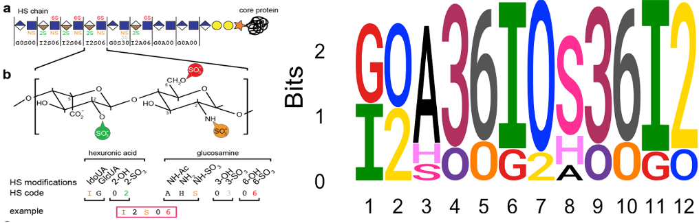

---
output:
  html_document: default
  pdf_document: default
---


1. Introduction:
----------------

Motif discovery from a given set of linear sequences is a common
computational problem. Many motif discovery tools and software are
available for finding motifs in DNA, RNA and protein sequences. These
software find motifs significantly enriched in the sequences composed of
single alphabet letters. However, motifs in some other biological
contents may not be consisted of single letters, for example, chemical
modifications on DNA or proteins. Here, we describe our
“HSMotifDiscover” tool that utilizes Gibbs Sampling algorithm to find
motifs in Heparan Sulfate (HS) sequences. HS sequences are linear
glycans of repeating disaccharides composed of hexuronic acids and
N-acetyle-glucosamines and added to membrane or extracellular proteins
to form specific proteoglycans. Further sulfate modifications on the
hexuronic acids and glucosamines generate HS motifs that are responsible
for the functions of HS sequences. Therefore, HS sequences are different
from the nucleic or protein sequences in at least three ways:

-   Each position is composed of a saccharide that can be modified in
    either one or two ways, resulting in a two- (“dimer”) or
    three-letter (“trimer”) representation for the types of saccharide
    and the chemical modifications.
-   The dimer and trimer are present alternatively as disaccharides in
    the HS sequences.
-   The motifs may be consisted of either same HS residues/types or same
    chemical modifications on different HS residues.

HSMotifDiscover tool considers these unique properties in searching for
enriched motifs in HS sequences. It first maps the saccharides to
“Lawrence codes” and then to alphabet letter. Motif search occurs in the
linear alphabet space and the resultant motifs are converted back to the
Lawrence codes for a logo visualization. In addition, we also consider
the scenario that the input HS sequences may come with scores or
weights. Similar to how DNA microarrays have been used to define DNA
motifs bound to transcription factors experimentally, array technology
has also been developed to help define HS motifs recognized by specific
proteins, including antibodies. The array assays yield an affinity score
for each of the short HS sequences that are synthesized and printed on
the array. The affinity profiles are then used to define HS motifs.
Thus, when available, HSMotifDiscover tool will use the binding affinity
scores to weight the HS sequences to find the enriched motifs for a
given antibody or protein, using either the full spectrum of affinity
scores or a predefined threshold to binarizing the input sequences to
protein-bound and unbound (background) sequences.

However, the HSMotifDiscover algorithm is not limited to HS sequences
only. It can be used for other glycan sequences. Moreover, we have
implemented it in a way that the tool can actually be used to discover
motifs in any kind of linear sequences, from simple cases like DNA, RNA,
protein sequences to more specific cases where the sequences can be
composed of either non-standard alphabet or words that represent dimers,
trimers or any combination of letters. Furthermore, to facilitate its
usage, we have also developed an interactive R Shiny App
(<a href="https://hsmotifdiscover.shinyapps.io/HSMotifDiscover_ShinyApp/" class="uri">https://hsmotifdiscover.shinyapps.io/HSMotifDiscover_ShinyApp/</a>),
which can be used by experimental biologists and others to find any type
of motifs.

2. Concept:
-----------

The HS sequences are diffrent from DNA, RNA and protein sequences in a
few ways. So, the Gibbs-Sampling algorithm has been implemented in such
a way, it can discover motifs in the heparan sulfate (HS) sequences.

3. Availability and Installation
--------------------------------

The development version of `HSMotifDiscover` package is available at
<a href="https://github.com/bioinfoDZ/HSMotifDiscover" class="uri">https://github.com/bioinfoDZ/HSMotifDiscover</a>
and can be installed as

``` r
# install.packages("devtools")
devtools::install_github("bioinfoDZ/HSMotifDiscover",build_vignettes = FALSE )
```

4. Functions
------------

### 4.1 HSMotifDiscover

**Description**

Discovers motif in heparan sulfate sequences or any other type of
sequences.

**Usage**

`HSMotifDiscover(input_HSseq_file, motif_range,  charGrpFile, seq_weight_file, numCores=1,  affinity_threshold=0,  itr=40000, if_revCompStrand=FALSE)`

**Arguments **

-   `input_HSseq_file`: A heparan sulfate sequence (or any other
    seqeunce) file. The file contains header and sequence information of
    the samples similar to fasta file, but sequence character counts per
    line are not constrained.
-   `motifLenVec`: Describe a vector of the motif lenghts to be
    discovered.
-   `charGrpFile`: (*Optional parameter*) File having two columns ,
    **One**- dimers/trimers/tetramers that should be considered as
    single characters to discover motif, **Two**- character group
    information in numeric form. In heparan sulfate dimer and trimer
    occupy alternate positions are. So, dimers are grouped in one group
    and trimers are grouped in other group. If this file is not given
    then each character will be considered independently to discover
    motif similar to other available motif discovery tools such as
    [MEME](https://meme-suite.org/meme/tools/meme). However, this tool
    has advantage over MEME discovery tool that it can be used for any
    type of characters.
-   `seq_weight_file`: (*Optional parameter*) File having column of
    sequence header and sequence weight in motif discovery. If this file
    is not selected then all sequences have equal weight in motif
    discovery.
-   `numCores` (*Optional parameter*) the number of cores to be used.
    This feature is useful when motif is discovered in large range. **In
    the current version, multiple cores feature may not work on windows
    computer or RStudio environment.**
-   `affinity_threshold`: (*Optional parameter*) The sequences with
    weight greater than the threshold are used for motif discovery. This
    is required only of weight file is given.
-   `itr`: (*Optional parameter*) Number of iterations for gibbs
    sampling optimisation. Higher itrations may improve the results but
    at the cost of time.
-   `if_revCompStrand`: logical variable, TURE if reverse complementry strand should also be considered while motif discovery (In case of DNA sequnces only).        Deafault value is FALSE

**Value**

1.  A list of following parameters of all the discovered motifs in the
    given range.
    -   `PSSM:` Position specific scoring matrix of the discovered
        motif.
    -   `MotifEntropy:` Average entropy of discovered motif.
    -   `IC:` Information content of the discovered motif.
    -   `bkgProb_vec:` Probability vector of the characters in the
        background sequences.
    -   `motif_Pval:` P-Value of the discovered motif.
    -   `CharDataf:` Summary of the input sequences characters.
    -   `orgChar_discoveredMotifs:` Sequences of the discovered motif.
    -   `MotifLogo:` Discovered motif seqlogo.
    -   `resultsTable_df:` Results of the discovered motif are
        summarised in the data frame. Where columns have following
        information.
        -   `header:` header of the sequences used for motif discovery
            `seqLen:` sequence length
        -   `if sequence weight is greater than the threshold:` boolean
            (TRUE/FALSE). This column is present only of weight of the
            sequences is given as input. `max_score:` Maximum likelihood
            score of the of the PSSM in the sequnce.
        -   `P_value:` The probability that a random sequence (with the
            same length and conforming to the background) would have
            position p-values such that the product is smaller or equal
            to the value calculated for the sequence under test.
        -   `MotifLoc:` Start point of discovered motif. (This is the
            location of max\_score in the sequence )
        -   `seq_weights:` Input weights of the sequnces. This column is
            present only of weight of the sequences is given as input.
        -   `score:` Liklihood score of the PSSM at different sequence
            locations.
        -   `RC_strand`: '1' if motif is present on reverse complementry strand (Only in case of DNA sequences).
2.  `MotifSummary_runTime_*.txt:` Summary of motifs in the text file.(* is the time of run)
3.  `log_runTime_*.txt:` log file of the run.(* is the time of run)

**Examples**

    > HSSeq_file=system.file("extdata", "Ex_simulated_HSseqs_new_M1c_and_M3c_S100E.txt", 
                            package = "HSMotifDiscover", mustWork = TRUE)
    > charGrpFile=system.file("extdata", "Chars.txt", package = "HSMotifDiscover", mustWork = TRUE)
    > seq_weight_file=system.file("extdata", "motif1c_Weight.txt", 
                          package = "HSMotifDiscover", mustWork = TRUE)
    > motifLenVec=c(5,7)   # motif length range
    > out=HSMotifDiscover(input_HSseq_file=HSSeq_file, motifLenVec=motifLenVec, 
                          charGrpFile=charGrpFile, seq_weight_file=seq_weight_file,
                          numCores=1,  affinity_threshold=0,  
                          itr=40000, if_revCompStrand=FALSE)
                          
      ##for DNA sequences ##
        
    > DNASeq_file=system.file("extdata", "SRF_syntheticSeqFile_Test.txt", 
                  package = "HSMotifDiscover", mustWork = TRUE)
    > outDNA=HSMotifDiscover(input_HSseq_file=DNASeq_file, 
                  motifLenVec=10, numCores=1, itr=50000, if_revCompStrand=TRUE)
  
